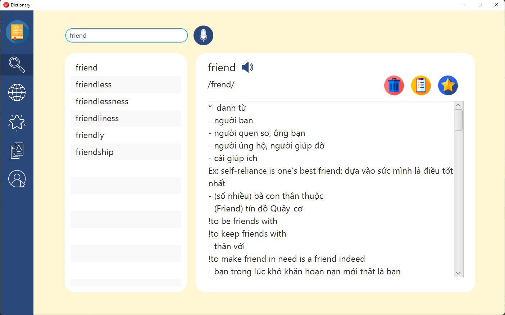

# Project OOP - Dictionary App
## 1. Tác giả:
* Nguyễn Thái Bình - 20020328
* Nguyễn Tấn Minh - 20020081
## 2. Ngôn ngữ lập trình
* IDE: IntelliJ
* Back-end: Java, JDBC
* Front-end: Javafx, CSS
* Database: MySQL
## 3. Chức năng:
* Tra từ offline

* Dịch văn bản (sử dụng Google API)

* Phát âm tiếng Anh
* Tra từ đồng nghĩa, trái nghĩa

* Thêm, sửa, xóa từ vựng

## 4. Cài đặt
* Cài đặt thư viện qua maven
* Cấu hình CSDL Mysql
